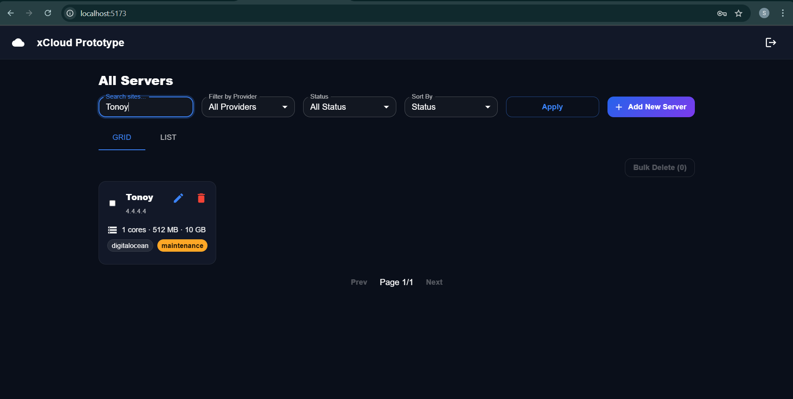

# Cloud Server Management (Track C — Full-Stack)

> A compact full-stack project to manage cloud servers with a modern, xCloud-style UI: **login**, **CRUD**, **search/filter/sort/pagination**, **bulk delete**, strong validation, and easy deploys on free tiers.


A starter full-stack app using a modern frontend stack (React + Vite + MUI + React Query) and a pragmatic backend (Node + Express + Mongoose). Designed to be easy to run locally (Docker or plain), easy to deploy to free tiers (Vercel + Render + MongoDB Atlas), and simple to extend.

---

Table of Contents

1. [Project Structure](#project-structure)  
2. [Features](#features)  
3. [Data Model & Validation](#data-model--validation)  
4. [Environment Variables](#environment-variables)  
5. [Run Locally (Backend + Frontend)](#run-locally-backend--frontend)  
6. [Seed Admin User](#seed-admin-user)  
7. [API Docs (curl)](#api-docs-curl)  
8. [Frontend UX Tour](#frontend-ux-tour)  
9. [Debugging Challenges](#debugging-challenges)  
10. [Testing (nice-to-have)](#testing-nice-to-have)  
11. [Docker & Docker Compose](#docker--docker-compose)  
12. [Security Notes](#security-notes)  
13. [Troubleshooting & FAQ](#troubleshooting--faq)  
14. [AI Collaboration Log](#ai-collaboration-log)  
15. [Tech Decisions & Trade-offs](#tech-decisions--trade-offs)  
16. [Time Spent (template)](#time-spent-template) 


---

# How Everything Works — End-to-End (Deep Dive)

This section is a plain-English + diagram explanation of how the app works from the moment a user opens the site to the database update. Put this block right after your short intro and before "Project Structure".

---

## Big Picture (at a glance)


Frontend (React) shows pages, forms, and tables.

Axios sends HTTP requests to /api/.... React Query caches responses, refetches when needed, and handles loading/error states.

Backend (Express) validates requests (Joi + Mongoose), enforces unique rules, and talks to MongoDB via Mongoose.

JWT lives in localStorage and is attached as Authorization: Bearer <token> for API calls.

Lifecycle: from page load to data saved

1) User opens the app  
Frontend loads the React app. If there’s a token in localStorage, the app treats the user as logged in (until proven otherwise). If no token, the router redirects to Login.

<!-- Optional screenshot placeholder -->


2) Login flow (username/email + password)


On success, backend returns a signed JWT; frontend saves it and redirects to Servers. On failure, a red error message is shown.


3) Servers list loads (data fetch)  
The Servers page uses React Query to fetch:

```bash
GET /api/servers?page=1&limit=10&search=...&provider=...&status=...&sortBy=...&sortOrder=...
```

The JWT is automatically attached by an Axios interceptor.


4) Filter/search/sort/paginate  
Typing in search or changing filters updates the query string and refetches.

Backend applies:
- Text search on name or ip_address ($regex)
- Equality filters on provider and status
- Sorting (e.g., createdAt desc)
- Pagination with page, limit




5) Create / Edit server (dialog)  
Clicking Add New opens a dialog (MUI). Client-side validation ensures required fields & ranges look valid before calling API.

Submit → POST /api/servers or PUT /api/servers/:id.

Backend runs Joi validation (with stripUnknown) and Mongoose validation (types, ranges, enums, unique indexes). If any rule fails (e.g., duplicate ip_address), backend returns a clean 400 with a helpful message.


  
  
  
  

Editing the Server:


6) Bulk delete  
Select multiple rows, click Bulk Delete → POST /api/servers/bulk-delete { ids: [...] }.

On success, list refetches; if one or more fail, a descriptive error shows and selection remains, avoiding state desync.


What the backend enforces
- Uniqueness
  - ip_address must be unique (global)
  - (name, provider) pair must be unique
- Value ranges
  - cpu_cores ∈ [1..128]
  - ram_mb ∈ [512..1048576]
  - storage_gb ∈ [10..1048576]
- Enums
  - provider ∈ {aws, digitalocean, vultr, other}
  - status ∈ {active, inactive, maintenance}
- Timestamps
  - createdAt, updatedAt are auto-managed by Mongoose

Indexing for speed (large lists):
- { name: 1, provider: 1 } (unique)
- { ip_address: 1 } (unique)
- { provider: 1, status: 1 }
- { createdAt: -1 }

UI Details (the polish)
- Status chips
  - active → green
  - inactive → red
  - maintenance → amber
- Destructive actions (Delete, Bulk Delete) are red buttons
- Dialogs use icons + clear labels + required marks
- Errors show helpful messages (from API) and do not mutate UI state if update fails (prevents desync)


Database View


Error handling & resilience

Client
- React Query exposes isLoading / isError to show spinners and friendly errors
- Optional Axios retry for transient 5xx (commented example included)

Server
- Joi validation errors → 400 with details
- Duplicate key (11000) → 400, message: "Duplicate Entry"
- Bad :id format → 400, message: "Invalid id"
- Not found → 404
- Rate-limited → 429
- Helmet sets security headers; CORS restricted to FRONTEND_URL


  
The website (React) shows screens and talks to the server (Express) using URLs starting with /api/.... The server checks that the data makes sense (is the IP a valid IPv4? is RAM within realistic limits?) and saves it to a database (MongoDB). You log in once; the website remembers you with a token so you don’t type the password each request. When you search or filter, the website asks the server for just the matching records and shows a page at a time (pagination) so it stays fast. If something goes wrong, the app shows a human-readable error and avoids getting out of sync.

---

## Appendix: Endpoint Map (quick glance)

```text
POST   /api/auth/login             → returns { token, user }
GET    /api/auth/me                → returns { user } (requires Authorization header)

GET    /api/servers                → list (search/filter/sort/pagination)
GET    /api/servers/:id            → one
POST   /api/servers                → create
PUT    /api/servers/:id            → update
DELETE /api/servers/:id            → remove
POST   /api/servers/bulk-delete    → remove many { ids: [...] }
```

Query params (list):
- page, limit
- search (matches name or ip_address)
- provider in {aws,digitalocean,vultr,other,all}
- status in {active,inactive,maintenance,all}
- sortBy (e.g., createdAt, name, provider, status)
- sortOrder in {asc,desc}

---


## Project Structure

```text
cloud-server-management/
├── README.md
├── .env.example
├── docker-compose.yml
├── Makefile                 # optional helper commands   
├── backend/
│   ├── Dockerfile
│   ├── .dockerignore
│   └── src/
│       ├── app.js
│       ├── config/
│       │   └── database.js
│       ├── controllers/
│       │   ├── authController.js
│       │   └── serverController.js
│       ├── middleware/
│       │   └── auth.js
│       ├── models/
│       │   ├── Server.js
│       │   └── User.js
│       ├── routes/
│       │   ├── auth.js
│       │   └── servers.js
│       ├── utils/
│       │   └── validation.js
│       └── seed.js
└── frontend/
    ├── Dockerfile
    ├── .dockerignore
    ├── vercel.json          # rewrites /api → backend when deployed on Vercel
    ├── nginx.conf           # used only with Docker/Nginx serving
    └── src/
        ├── main.jsx
        ├── App.jsx
        ├── theme.js
        ├── api.js
        ├── hooks/
        │   ├── useAuth.js
        │   └── useServers.js
        ├── pages/
        │   ├── LoginPage.jsx
        │   └── ServersPage.jsx
        └── components/
            ├── AppTopBar.jsx
            ├── FiltersBar.jsx
            ├── ServerFormDialog.jsx
            ├── ServerRow.jsx
            └── ServerCard.jsx
```

---

## Features

- Auth: JWT login (seeded admin).
- Servers: Create, Read, Update, Delete + Bulk Delete.
- Productivity: Search, filter, sort, pagination.
- UI Modes: List/Grid toggle.
- Validation: Joi (API layer) + Mongoose (model layer).
- Performance: Query indexes + pagination + `.lean()`.
- Security: Helmet headers, rate limiting.
- Ops: Dockerized services + free hosting recipe.

---

## Data Model & Validation

Server
- name — unique per provider
- ip_address — valid IPv4, globally unique
- provider — one of: `aws`, `digitalocean`, `vultr`, `other`
- status — one of: `active`, `inactive`, `maintenance`
- cpu_cores — integer `[1..128]`
- ram_mb — integer `[512..1048576]`
- storage_gb — integer `[10..1048576]`
- createdAt, updatedAt — automatic

Indexes
- `{ name: 1, provider: 1 }` — unique
- `{ ip_address: 1 }` — unique
- `{ provider: 1, status: 1 }`
- `{ createdAt: -1 }`

Validation
- Joi schema used for request validation (stripUnknown enabled).
- Mongoose schema includes limits and unique constraints.
- Duplicate key errors are mapped to human-friendly messages.

---

## Environment Variables

Root `.env.example` (copy to `.env`):

```bash
COMPOSE_PROJECT_NAME=cloudsrv
FRONTEND_PORT=5173
BACKEND_PORT=5000
MONGO_PORT=27017

JWT_SECRET=change_me_to_a_long_random_string
NODE_ENV=production
MONGODB_URI=mongodb://mongo:27017/cloudservers
FRONTEND_URL=http://localhost:5173   # Vite dev URL (5173). Use 5173 if Docker frontend

ADMIN_USERNAME=admin
ADMIN_EMAIL=admin@hotmail.com
ADMIN_PASSWORD=admin123
```

Notes:
- On Render (backend): set MONGODB_URI to your Atlas connection string, set JWT_SECRET to a long random string, and FRONTEND_URL to your Vercel URL.
- Keep secrets out of your repo.

---

## Run Locally (Backend + Frontend)

0) Prereqs
- Node.js 18+ (or 20+)
- npm
- MongoDB (local) or MongoDB Atlas

1) Backend (dev)
```bash
cd backend
cp ../.env.example .env      # or create your own .env
npm install
npm run dev                  # http://localhost:5000
# health: http://localhost:5000/api/health
```

If you use Vite dev server, set backend `FRONTEND_URL=http://localhost:5173` and restart backend.

2) Seed admin (first run)
```bash
# still in backend/
node src/seed.js
# login: admin / admin123
```

3) Frontend (dev)
```bash
cd ../frontend
npm install
npm run dev                  # http://localhost:5173
```

Open http://localhost:5173 and log in with admin / admin123.

---

## Seed Admin User

```bash
cd backend
# requires ADMIN_USERNAME / ADMIN_EMAIL / ADMIN_PASSWORD in env
node src/seed.js
```

- If the admin exists, the script does nothing.
- Otherwise it creates the admin user.

---

## API Docs (curl)

Base URL (dev): `http://localhost:5000/api`  
Base URL (prod): Render URL, e.g. `https://<service>.onrender.com/api`

Examples:
```bash
# Login
curl -X POST http://localhost:5000/api/auth/login \
  -H "Content-Type: application/json" \
  -d '{"usernameOrEmail":"admin","password":"admin123"}'

# Me (requires token)
curl http://localhost:5000/api/auth/me \
  -H "Authorization: Bearer <TOKEN>"

# List (search/filter/sort/pagination)
curl "http://localhost:5000/api/servers?page=1&limit=10&search=10.0&provider=aws&status=active&sortBy=createdAt&sortOrder=desc" \
  -H "Authorization: Bearer <TOKEN>"

# Get one
curl http://localhost:5000/api/servers/<id> \
  -H "Authorization: Bearer <TOKEN>"

# Create
curl -X POST http://localhost:5000/api/servers \
  -H "Authorization: Bearer <TOKEN>" \
  -H "Content-Type: application/json" \
  -d '{"name":"web-01","ip_address":"10.0.0.11","provider":"aws","status":"inactive","cpu_cores":2,"ram_mb":2048,"storage_gb":50}'

# Update
curl -X PUT http://localhost:5000/api/servers/<id> \
  -H "Authorization: Bearer <TOKEN>" \
  -H "Content-Type: application/json" \
  -d '{"status":"active","cpu_cores":4}'

# Delete
curl -X DELETE http://localhost:5000/api/servers/<id> \
  -H "Authorization: Bearer <TOKEN>"

# Bulk delete
curl -X POST http://localhost:5000/api/servers/bulk-delete \
  -H "Authorization: Bearer <TOKEN>" \
  -H "Content-Type: application/json" \
  -d '{"ids":["<id1>","<id2>"]}'
```

---

## Frontend UX Tour

- Login — token stored in localStorage.
- Servers page:
  - Filters: search by name/IP, filter by provider/status, sort.
  - List/Grid toggle, both support selection checkboxes + Bulk Delete.
  - Add New Server → polished dialog with icons & validation.
  - Status chips: green=active, red=inactive, amber=maintenance.

---

## Debugging Challenges

- Slow Query (5k+ rows) — add indexes `{name+provider}`, `{ip_address}`, `{provider,status}`, `{createdAt}`, use pagination and `.lean()`.
- Validation Edge Case (duplicate IP under concurrency) — unique index on `ip_address`; catch Mongo code `11000` → show “Duplicate Entry”.
- State Desync (UI wrong after failed update) — React Query cache invalidation; backend uses Joi stripUnknown; frontend sends only whitelisted fields.
- Flaky Network (random 500s) — consider Axios retry interceptor with exponential backoff.
- Race Condition (two updates collide) — demo keeps last-write-wins; document path to optimistic locking via `__v` for production.

---

## Testing

- Backend (Postman, Insomnia): validate IPv4, duplicate errors, auth guards.
- Frontend (React Testing Library): “create server → appears in list”.


## Docker & Docker Compose

Build & start everything:
```bash
cp .env.example .env
docker compose up -d --build
```

Seed admin (one-off):
```bash
docker compose run --rm --profile seed seed
```

Open:
- UI → http://localhost:5173
- API → http://localhost:5000/api/health

Stop:
```bash
docker compose down
```

Included Dockerfiles and configs are provided in `backend/` and `frontend/`.

---


## Security Notes

- Use a strong `JWT_SECRET`.
- Helmet + rate limiter enabled on `/api`.
- Validation both client and server.
- Mongo unique indexes enforce IP and `(name + provider)`.
- Keep environment variables and secrets out of git. Use platform secrets for production.

---


## AI Collaboration Log

- Tools: ChatGPT (scaffold/docs), Claude (alt scaffolds), Copilot (micro edits).
- Asked & Why: speed up boilerplate, improve UI polish, fix validation, Joi stripUnknown helping, Docker files, Generating Scripts for automation
- Accepted vs. Rewrote: accepted base routes/models/UI shells; rewrote Joi `stripUnknown`, Axios retry, theme chip overrides, proxy config.
- Bugs & Fixes: CRA → migrated to Vite; chip colors overridden → scoped theme; 400 update → whitelist payload + backend strips unknown.

---

## Tech Decisions & Trade-offs

- Mongo over SQL for speed; indexes cover query patterns.
- JWT over sessions for simplicity on free hosts.
- React Query to avoid manual state bugs and handle caching.
- Free tiers (Vercel/Render/Atlas) → frictionless deploys; cold starts acceptable for demo.
- Left optimistic concurrency as a documented option; demo keeps last-write-wins.

---

## Time Spent (template)

```text
Planning & reading challenge .......... ~2 hours
Backend model & routes ................ ~3 hours
Validation & error handling ........... ~1 hour
Frontend UI & state ................... ~5 hours
Docker & Compose ...................... ~25 minutes
Docs .................................. ~1 hours
TOTAL ................................. ~11 hours
```

---
